> Nama: Fahridana Ahmad Rayyansyah <br/>
> Absen: 11 <br/>
> Kelas: TI-2F

# Jobsheet 4

## Praktikum 1 - $fillable
1. UserModel.php
    ```php
    class UserModel extends Model {
        use HasFactory;
        protected $table = 'm_user';
        protected $primaryKey = 'user_id';
        protected $fillable = ['level_id', 'username', 'name', 'password'];
    }
    ```
2. UserController.php
    ```php
    class UserController extends Controller
    {
        public function index() {
            $data = [
                'level_id' => 2,
                'username' => 'manager_dua',
                'name' =>'Manager 2',
                'password' => Hash::make('12345')
            ];
            UserModel::create($data);
   
            $user = UserModel::all();
            return view('user', ['data' => $user]);
        }
    }
    ```
3. Apa yang terjadi? <br/>
    **Jawab:**<br/>
    > yang terjadi adalah ketika dibuka di browser, php akan memasukkan data ke db, dan data tersebut ditampilkan di browser
    <br/>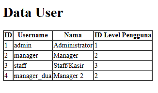 

4. Ubah UserModel.php menjadi
    ```php 
    protected $fillable = ['level_id', 'username', 'name'];
    ```
5. dan ubah UserController.php menjadi
    ```php
    class UserController extends Controller
    {
        public function index() {
            $data = [
                'level_id' => 2,
                'username' => 'manager_tiga',
                'name' =>'Manager 3',
                'password' => Hash::make('12345')
            ];
            UserModel::create($data);
   
            $user = UserModel::all();
            return view('user', ['data' => $user]);
        }
    }
    ```
6. Apa yang terjadi? <br/>
    **Jawab**
    > Yang terjadi adalah data tidak dapat dimasukkan ke db, karena tidak adanya fillable password
   <br/>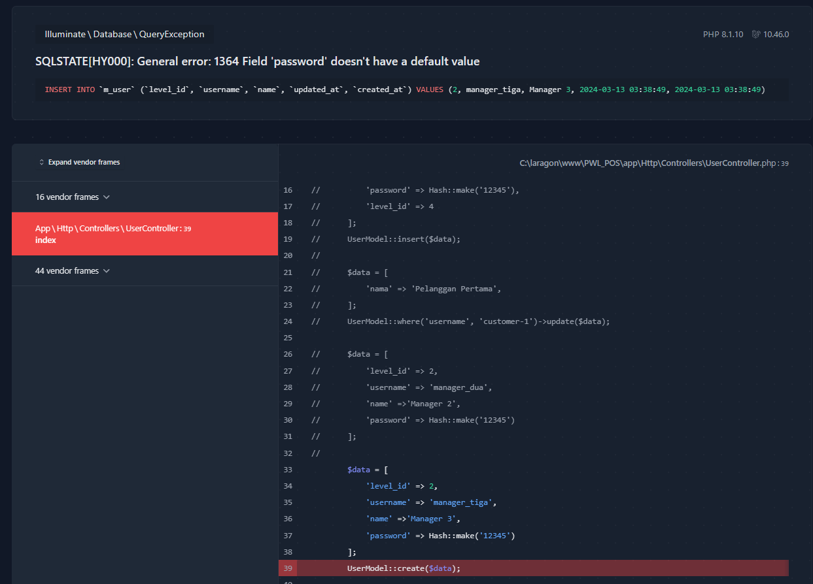

7. Jabarkan Mass assignment <br/>
    **Jawab:**
    > Mass assignment memungkinkan untuk menjalankan beberapa operasi pada model database dengan satu baris kode saja

## Praktikum 2.1 – Retrieving Single Models
1. UserController.php
    ```php
        class UserController extends Controller
        {
            public function index() {
                $user = UserModel::find(1);
                return view('user', ['data' => $user]);
            }
        }
    ```

2. user.blade.php
    ```php
    <!DOCTYPE html>
    <html>
        <head>
            <title>Data User</title>
        </head>
        <body>
            <h1>Data User</h1>
            <table border="1" cellpadding="1" cellspacing="1">
                <tr>
                    <th>ID</th>
                    <th>Username</th>
                    <th>Nama</th>
                    <th>ID Level Pengguna</th>
                </tr>
                    <tr>
                        <td>{{$data->user_id}}</td>
                        <td>{{$data->username}}</td>
                        <td>{{$data->name}}</td>
                        <td>{{$data->level_id}}</td>
                    </tr>
            </table>
        </body>
    </html>
    ```
   
3. Jelaskan apa yang terjadi! <br/>
    **Jawab:**
    > pada userController, fungsi find(1) digunakan untuk mencari data yang primary keynya = 1,
   > setelah itu data dipassing kedalam view dalam bentuk variabel `$data`
   <br/>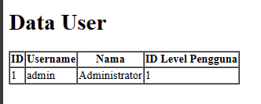

4. ubah UserController.php
    ```php
        class UserController extends Controller
        {
            public function index() {
                $user = UserModel::where('level_id', 1)->first();
                return view('user', ['data' => $user]);
            }
        }
    ```
5. Jelaskan <br/>
    **Jawab:**
    > pada userController, laravel akan mencari data dimana level_id = 1, dan hanya mengambil data
   > pertama, lalu data dilempar ke view\
   <br/>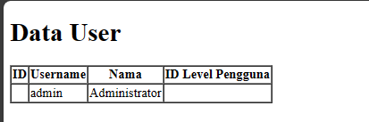

6. ubah UserController.php
    ```php
        class UserController extends Controller
        {
            public function index() {
                $user = UserModel::firstWhere('level_id', 1);
                return view('user', ['data' => $user]);
            }
        }
    ```
7. Jelaskan <br/>
    **Jawab:**
    > Fungsinya sama seperti sebelumnya, yaitu mencari data pertama dimana level_id = 1
   <br/>

8. Ubah UserController.php
    ```php
        class UserController extends Controller
        {
            public function index() {
                $user = UserModel::findOr(1, ['username', 'name'], function () {
                    abort(404);
                });
                return view('user', ['data' => $user]);
            }
        }
    ```
9. Jelaskan <br/>
    **Jawab:**
    > fungsi tersebut digunakan untuk mencari data dimana primary key = 1, namun jika data tidak ditemukan
    > akan menjalankan fungsi dimana isinya abort(404), pada kasus ini data ditemukan dan menampilkan data 
   yang primary key = 1
   <br/> 

10. Ubah UserController.php
    ```php
        class UserController extends Controller
        {
            public function index() {
                $user = UserModel::findOr(20, ['username', 'name'], function () {
                    abort(404);
                });
                return view('user', ['data' => $user]);
            }
        }
    ```
11. Jelaskan <br/>
    **Jawab:**
    > seperti yang dijelaskan sebelumnya, namun pada kasus ini data tidak ditemukan
    > dan menjalankan fungsi abort(404) dimana data not found
    <br/> 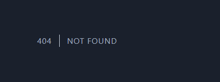

## Praktikum 2.2 – Not Found Exceptions
1. ubah UserController.php
    ```php
        class UserController extends Controller
        {
            public function index() {
                $user = UserModel::findOrFail(1);
                return view('user', ['data' => $user]);
            }
        }
    ```
2. Jelaskan <br/>
   **Jawab:**
    > disini fungsi findOrFail(1) digunakan untuk mencari data yang primary key = 1, namun
    jika data tidak ditemukan maka fungsi tersebut akan melempar sebuah exception
   <br/> 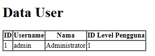

3. ubah UserController.php
    ```php
        class UserController extends Controller
        {
            public function index() {
                $user = UserModel::where('username', 'manager9')->firstOrFail();
                return view('user', ['data' => $user]);
            }
        }
    ```
4. Jelaskan <br/>
   **Jawab:**
    > Fungsi tersebut akan mencari data dimana username = 'manager9' lalu terdapat fungsi firstOrFail() dimana
   > akan mengambil data pertama, dan bila data tidak ditemukan, laravel akan melempar sebuah exception
   <br/> 

## Praktikum 2.3 – Retreiving Aggregrate
1. ubah UserController.php
    ```php
        class UserController extends Controller
        {
            public function index() {
                $user = UserModel::where('level_id', 2)->count();
                dd($user);
                return view('user', ['data' => $user]);
            }
        }
    ```
2. Jelaskan <br/>
    **Jawab**
    > kode tersebut awalnya akan menghitung jumlah data yang dihasilkan oleh fungsi where
   > lalu terdapat fungsi dd($user) yang berfungsi untuk melakukan cetak dan eksekusi script dihentikan
   > jadi return view() tersebut tidak dieksekusi karena dd($user) menghentikan eksekusi script
   <br/> 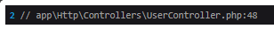

3. Ubah agar data tampil
   1. UserController
        ```php
            class UserController extends Controller
            {
                public function index() {
                    $user = UserModel::where('level_id', 2)->count();
                    return view('user', ['data' => $user]);
                }
            }
        ```
   2. view
        ```php
        <!DOCTYPE html>
        <html>
            <head>
                <title>Data User</title>
            </head>
            <body>
                <h1>Data User</h1>
                <table border="1" cellpadding="1" cellspacing="1">
                    <tr>
                        <th>Jumlah Pengguna</th>
                    </tr>
                        <tr>
                            <td>{{$data}}</td>
                        </tr>
                </table>
            </body>
        </html>
        ```
   3. Output  <br/>
   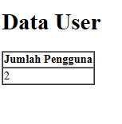

## Praktikum 2.4 – Retreiving or Creating Models
1. UserController.php
    ```php
        class UserController extends Controller
        {
            public function index() {
                $user = UserModel::firstOrCreate([
				    'username' => 'manager',
				    'name' => 'Manager'
			    ]);
                return view('user', ['data' => $user]);
            }
        }
    ```
2. user.blade.php
    ```php
    <!DOCTYPE html>
    <html>
        <head>
            <title>Data User</title>
        </head>
        <body>
            <h1>Data User</h1>
            <table border="1" cellpadding="2" cellspacing="0">
                <tr>
                    <th>ID</th>
                    <th>Username</th>
                    <th>Nama</th>
                    <th>ID Level Pengguna</th>
                </tr>
                    <tr>
                        <td>{{$data->user_id}}</td>
                        <td>{{$data->username}}</td>
                        <td>{{$data->name}}</td>
                        <td>{{$data->level_id}}</td>
                    </tr>
            </table>
        </body>
    </html>
    ```
3. jelaskan <br/>
    **Jawab:**
    > Fungsi tersebut akan mencari data yang cocok dimana pada kasus ini username = manager dan
   > nama = Manager, jika data tersebut tidak ada maka laravel akan membuatkan data tersebut dan
   > menyimpannya di database, setelah itu data akan dilempar ke views dan akan tertampil di browser
   <br/> 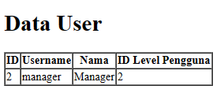

4. Ubah UserController.php
    ```php
        class UserController extends Controller
        {
            public function index() {
                $user = UserModel::firstOrCreate([
				    'username' => 'manager22',
				    'name' => 'Manager Dua Dua',
				    'password' => Hash::make('12345'),
				    'level_id' => 2
			    ]);
   
                return view('user', ['data' => $user]);
            }
        }
    ```
5. Jelaskan <br/>
    **Jawab**
    > Sama seperti yang sebelumnya, namun pada kasus ini mencari data yang sesuai dengan
   'username' => 'manager22',
   'name' => 'Manager Dua Dua',
   'password' => Hash::make('12345'),
   'level_id' => 2
   <br/> 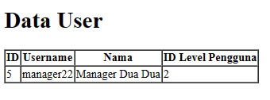

6. UserController.php 
     ```php
        class UserController extends Controller
        {
            public function index() {
                $user = UserModel::firstOrNew([
				    'username' => 'manager',
				    'name' => 'Manager'
			    ]);
                return view('user', ['data' => $user]);
            }
        }
    ```
7. Jelaskan <br/>
   **Jawab**
    > Mirip seperti firstOrCreate dimana jika data tersebut tidak ada di database, laravel akan membuatkan data tersebut, namun
   > bedanya di firstOrNew data tidak disimpan
   <br/> 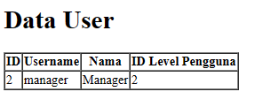

8. Ubah UserController.php
    ```php
        class UserController extends Controller
        {
            public function index() {
                $user = UserModel::firstOrNew([
				    'username' => 'manager33',
				    'name' => 'Manager Tiga Tiga',
				    'password' => Hash::make('12345'),
				    'level_id' => 2
			    ]);
   
                return view('user', ['data' => $user]);
            }
        }
    ```
9. Jelaskan <br/>
   **Jawab**
    > Sama seperti sebelumnya
   <br/> 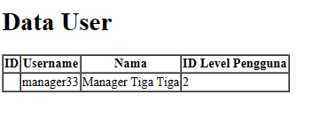

10. Ubah UserController.php
    ```php
        class UserController extends Controller
        {
            public function index() {
                $user = UserModel::firstOrNew([
				    'username' => 'manager33',
				    'name' => 'Manager Tiga Tiga',
				    'password' => Hash::make('12345'),
				    'level_id' => 2
			    ]);
                $user->save();
   
                return view('user', ['data' => $user]);
            }
        }
    ```
11. Jelaskan <br/>
    **Jawab**
    > Sama seperti sebelumnya, namun data disimpan ke database
    <br/> 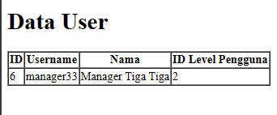


## Praktikum 2.5 – Attribute Changes
1. UserController.php
    ```php
        class UserController extends Controller
        {
            public function index() {
                $user = UserModel::create([
			        'username' => 'manager55',
		            'name' => 'Manager55',
		            'password' => Hash::make('12345'),
		            'level_id' => 2,
	            ]);

		        $user->username = 'manager56';

		        $user->isDirty();
		        $user->isDirty('username');
                $user->isDirty('name');
                $user->isDirty(['name', 'username']);

                $user->isClean();
                $user->isClean('username');
                $user->isClean('name');
                $user->isClean(['name', 'username']);
        
                $user->save();
        
                $user->isDirty();
                $user->isClean();
                dd($user->isDirty());
            }
        }
    ```

2. Jelaskan <br/>
    **Jawab:**
    > isDirty() digunakan untuk mengetahui apakah ada atribut model yang telah diubah, contohnya pada kode diatas
   > dimana username diubah menjadi manager56 yang mana akan membuat $user->isDirty('username'); menjadi true, lalu fungsi isClean()
   > adalah kebalikan dari isDirty()
   <br/> 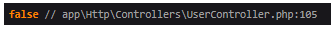

3. ubah UserController.php
    ```php
        class UserController extends Controller
        {
            public function index() {
                $user = UserModel::create([
			        'username' => 'manager11',
		            'name' => 'Manager11',
		            'password' => Hash::make('12345'),
		            'level_id' => 2
	            ]);

		        $user->username = 'manager12';

		        $user->save();

		        $user->wasChanged();
		        $user->wasChanged('username');
		        $user->wasChanged(['username', 'level_id']);
		        $user->wasChanged('name');
		        dd($user->wasChanged(['name', 'username']));
            }
        }
    ```
4. Jelaskan <br/>
   **Jawab:**
    > metode wasChanged() digunakan untuk memerikas apakah ada atribut yang telah barubah setelah model disimpan
   > dan itulah yang membedaknnya dari isDirty, jika isDirty dan isClean hanya memeriksa sebelum disimpan
   > sedangkan wasChanged diperiksa setelah model disimpan
   <br/> 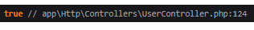

## Praktikum 2.6 – Create, Read, Update, Delete (CRUD)
1. UserController.php
    ```php
        class UserController extends Controller
        {
            public function tambah() {
		        return view('user_tambah');
            }
        
            public function tambah_simpan(Request $request) {
                UserModel::create([
                    'username' => $request->username,
                    'name' => $request->name,
                    'password' => Hash::make('$request->password'),
                    'level_id' => $request->level_id
                ]);
        
                return redirect('/user');
            }
        
            public function ubah($id)
            {
                $user = UserModel::find($id);
                return view('user_ubah', ['data' => $user]);
            }
        
            public function ubah_simpan($id, Request $request) {
                $user = UserModel::find($id);
        
                $user->username = $request->username;
                $user->name = $request->name;
                $user->password = Hash::make('$request->password');
                $user->level_id = $request->level_id;
        
                $user->save();
        
                return redirect('/user');
            }
        
            public function hapus($id) {
                $user = UserModel::find($id);
                $user->delete();
        
                return redirect('/user');
            }
        }
    ```

2. views
    1. user.blade.php
        ```php
        <!DOCTYPE html>
        <html>
            <head>
                <title>Data User</title>
            </head>
            <body>
                <h1>Data User</h1>
                <a href="user/tambah">+ Tambah User</a>
                <table border="1" cellpadding="1" cellspacing="1">
                    <tr>
                        <th>ID</th>
                        <th>Username</th>
                        <th>Nama</th>
                        <th>ID Level Pengguna</th>
                        <th>Aksi</th>
                    </tr>
                    @foreach($data as $d)
                        <tr>
                            <td>{{$d->user_id}}</td>
                            <td>{{$d->username}}</td>
                            <td>{{$d->name}}</td>
                            <td>{{$d->level_id}}</td>
                            <td><a href="user/ubah/{{$d->user_id}}">Ubah</a> | <a href="user/hapus/{{$d->user_id}}">Hapus</a></td>
                        </tr>
                    @endforeach
                </table>
            </body>
        </html>
        ```
    2. user_tambah.blade.php
        ```php
           <!doctype html>
           <html lang="en">
           <head>
               <meta charset="UTF-8">
               <meta name="viewport"
                     content="width=device-width, user-scalable=no, initial-scale=1.0, maximum-scale=1.0, minimum-scale=1.0">
               <meta http-equiv="X-UA-Compatible" content="ie=edge">
               <title>Tambah User</title>
           </head>
           <body>
               <h1>Form Tambah Data User</h1>
               <form method="post" action="/PWL_POS/public/user/tambah_simpan">
                   {{csrf_field()}}
        
                   <label>Username</label>
                   <input type="text" name="username" placeholder="Masukkan Username">
                   <br>
                   <label>Nama</label>
                   <input type="text" name="name" placeholder="Masukkan Nama">
                   <label>Password</label>
                   <input type="password" name="password" placeholder="Masukkan Password">
                   <br>
                   <label>Level ID</label>
                   <input type="number" name="level_id" placeholder="Masukkan ID Level">
                   <br><br>
                   <input type="submit" class="btn btn-success" value="Simpan">
               </form>
           </body>
           </html>
       ```
    3. user_ubah.blade.php
        ```php
           <!doctype html>
           <html lang="en">
           <head>
               <meta charset="UTF-8">
               <meta name="viewport"
                     content="width=device-width, user-scalable=no, initial-scale=1.0, maximum-scale=1.0, minimum-scale=1.0">
               <meta http-equiv="X-UA-Compatible" content="ie=edge">
               <title>Ubah User</title>
           </head>
           <body>
           <h1>Form Ubah Data User</h1>
           <a href="/PWL_POS/public/user">Kembali</a>
           <br><br>
           <form method="post" action="/PWL_POS/public/user/ubah_simpan/{{$data->user_id}}">
               {{csrf_field()}}
               {{method_field('PUT')}}
        
               <label>Username</label>
               <input type="text" name="username" placeholder="Masukkan Username" value="{{$data->username}}">
               <br>
               <label>Nama</label>
               <input type="text" name="name" placeholder="Masukkan Nama" value="{{$data->name}}">
               <label>Password</label>
               <input type="password" name="password" placeholder="Masukkan Password" value="{{$data->password}}">
               <br>
               <label>Level ID</label>
               <input type="number" name="level_id" placeholder="Masukkan ID Level" value="{{$data->level_id}}">
               <br><br>
               <input type="submit" class="btn btn-success" value="Simpan">
           </form>
           </body>
           </html>
       ```
3. web.php
    ```php
    Route::get('/user/tambah', [UserController::class, 'tambah']);
    Route::post('/user/tambah_simpan', [UserController::class, 'tambah_simpan']);
    Route::get('/user/ubah/{id}', [UserController::class, 'ubah']);
    Route::put('/user/ubah_simpan/{id}', [UserController::class, 'ubah_simpan']);
    Route::get('/user/hapus/{id}', [UserController::class , 'hapus']);
    ```
4. Output <br/>
   <br/> 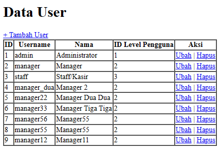
   <br/> 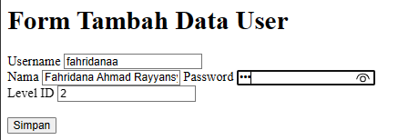
   <br/> 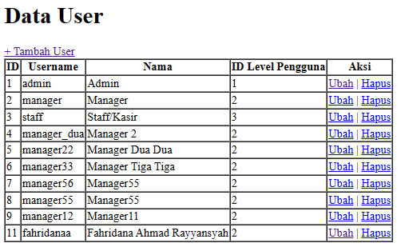
   
## Praktikum 2.7 – Relationships
1. UserModel.php
    ```php
    class UserModel extends Model
    {
        use HasFactory;
    
        protected $table = 'm_user';
        protected $primaryKey = 'user_id';
    
        protected $fillable = ['level_id', 'username', 'name', 'password'];
    
        public function level(): BelongsTo
        {
            return $this->belongsTo(LevelModel::class);
        }
    }
    ```
2. UserController.php
    ```php
        class UserController extends Controller
        {
            public function index() {
                $user = UserModel::with('level')->get();
                dd($user);
            }
        }
    ```
3. Jelaskan <br/>
    **Jawab:**
    > pada UserModel terdapat fungsi level() dimana mendefinisikan relasi dengan LevelModel
   > lalu pada UserController akan mengambil semua data pada m_user dan mengambil data levelnya saja
   > setelah itu terdapat dd($user) yang akan mencetak hasil query tersebut
   <br/> 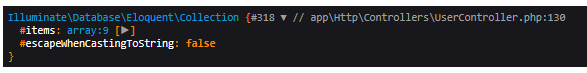