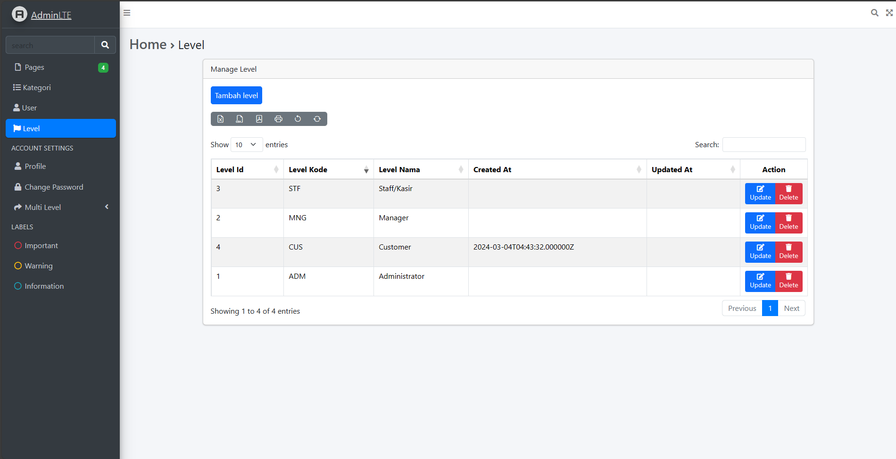
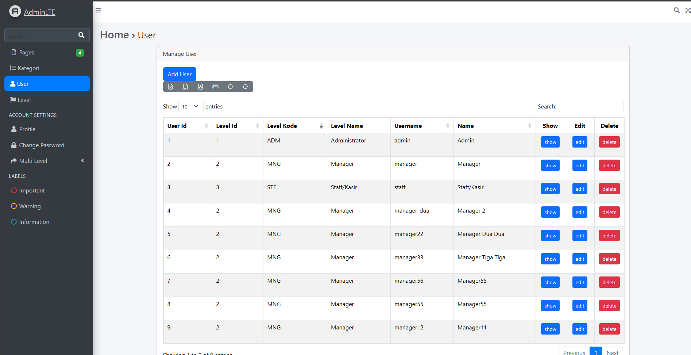
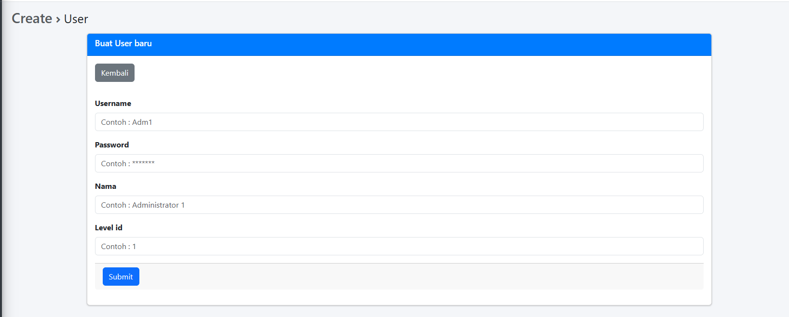
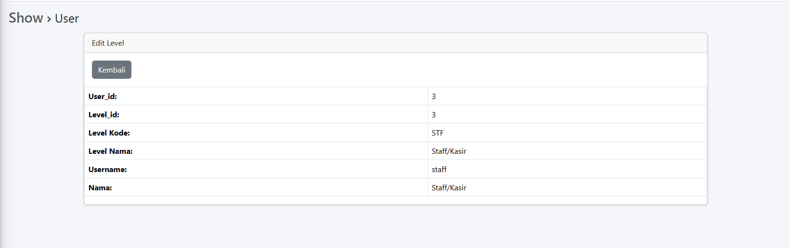
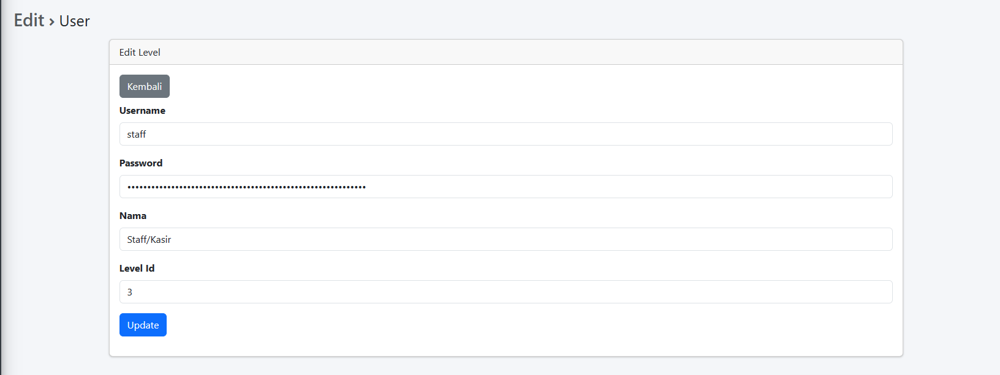

> Nama: Fahridana Ahmad Rayyansyah  
> Absen: 11  
> Kelas: TI-2F

# Jobsheet 6

## Hasil Praktikum
1. Table Level
   
2. Table User
   
   1. create
      
   2. show
      
   3. edit
      
   4. delete
      

## Tugas Praktikum
1. Coba tampilkan level_id pada halaman web tersebut dimana field ini merupakan foreign key 
   **Jawab:**
   > Aman  
   > 
2. Modifikasi dengan tema/ template kesukaan Anda 
   **Jawab:**
   > Kebetulan saya suka tema yang default
3. Apa fungsi $request->validate, $error dan alert yang ada pada halaman CRUD tersebut 
   **Jawab:**
   > * fungsi `$request->validate` adalah untuk melakukan validasi terhadap data yang diterima
   > * `$errors` digunakan untuk menampilkan error validasi pada view
   > * `$alert` digunakan untuk menampilkan pemberitahuan ke pengguna

[//]: # (# Jobsheet 3)

[//]: # ()
[//]: # (## Tugas)

[//]: # (1. Pada **Praktikum 1 - Tahap 5**, apakah fungsi dari APP_KEY pada file setting .env Laravel?  )

[//]: # (    **Jawab :**)

[//]: # (    > untuk mengenkripsi data pengguna, APP_KEY juga digunakan dalam hashing dan dalam proses otentikasi.)

[//]: # ()
[//]: # (2. Pada **Praktikum 1**, bagaimana kita men-generate nilai untuk APP_KEY?  )

[//]: # (   **Jawab :**)

[//]: # (    > dengan menuliskan `php artisan key:generate` di terminal)

[//]: # ()
[//]: # (3. Pada **Praktikum 2.1 - Tahap 1**, secara default Laravel memiliki berapa file migrasi?)

[//]: # (   dan untuk apa saja file migrasi tersebut?  )

[//]: # (   **Jawab :**)

[//]: # (    > File - file ini merupakan bagian dari setup default laravel )

[//]: # (   > dan file ini bertujuan untuk membuat struktur awal database)

[//]: # ()
[//]: # (4. Secara default, file migrasi terdapat kode `$table->timestamps&#40;&#41;;`, apa tujuan/output)

[//]: # (   dari fungsi tersebut?  )

[//]: # (    **Jawab :**)

[//]: # (    > kode `$table->timestamps&#40;&#41;;` bertujuan untuk menambah dua kolom, yaitu kolom)

[//]: # (   > `created_at` dan `updated_at` ke dalam tabel. fungsi `created_at` digunakan untuk)

[//]: # (   > mencatat kapan baris/data tersebut dibuat, sedangkan fungsi `updated_at` digunakan)

[//]: # (   > untuk mencatat kapan terakhir kali baris/data tersebut diperbarui)

[//]: # ()
[//]: # (5. Pada File Migrasi, terdapat fungsi `$table->id&#40;&#41;;` Tipe data apa yang dihasilkan dari)

[//]: # (   fungsi tersebut?  )

[//]: # (    **Jawab :**)

[//]: # (    > fungsi kode tersebut untuk membuat kolom id pada tabel dan akan diatur sebagai)

[//]: # (   > primary key)

[//]: # ()
[//]: # (6. Apa bedanya hasil migrasi pada table m_level, antara menggunakan `$table->id&#40;&#41;;`)

[//]: # (   dengan menggunakan `$table->id&#40;'level_id'&#41;;` ? )

[//]: # (   **Jawab :**)

[//]: # (   > perbedaannya ada di nama kolom tersebut, jika hanya `$table->id&#40;&#41;;` maka akan membuat)

[//]: # (   > kolom dengan nama **id** sedangkan `$table->id&#40;'level_id'&#41;;` akan membuat kolom dengan nama)

[//]: # (   > **level_id**)

[//]: # ()
[//]: # (7. Pada migration, Fungsi `->unique&#40;&#41;` digunakan untuk apa? )

[//]: # (   **Jawab :**)

[//]: # (   > fungsi tersebut digunakan agar suatu kolom harus memiliki nilai yang unik, maksudnya tidak ada)

[//]: # (   > dua baris yang dapat memiliki nilai sama di kolom tersebut )

[//]: # ()
[//]: # (8. Pada **Praktikum 2.2 - Tahap 2**, kenapa kolom level_id pada tabel `m_user`)

[//]: # (   menggunakan `$tabel->unsignedBigInteger&#40;'level_id'&#41;`, sedangkan kolom `level_id`)

[//]: # (   pada tabel `m_level` menggunakan `$tabel->id&#40;'level_id'&#41;` ?  )

[//]: # (   **Jawab :**)

[//]: # (    > karena `level_id` pada tabel `m_user` merupakan sebuah **FOREIGN KEY** dari tabel `m_level` sehingga)

[//]: # (dibutuhkan tipe data yang menampung integer yang besar, sedangkan pada tabel `m_level` menggunakan id karena)

[//]: # (   kolom `level_id` merupakan **PRIMARY KEY** dari tabel `m_level`)

[//]: # ()
[//]: # (9. Pada **Praktikum 3 - Tahap 6**, apa tujuan dari Class Hash? dan apa maksud dari kode)

[//]: # (   program `Hash::make&#40;'1234'&#41;;`?  )

[//]: # (   **Jawab :**)

[//]: # (   > class Hash digunakan untuk mengenkripsi data yang memang perlu disimpan dalam bentuk terenkripsi.)

[//]: # (kode `Hash::make&#40;'1234'&#41;;` digunakan untuk menghasilkan versi hashed dari '1234')

[//]: # ()
[//]: # (10. Pada **Praktikum 4 - Tahap 3/5/7**, pada query builder terdapat tanda tanya `&#40;?&#41;`, apa)

[//]: # (    kegunaan dari tanda tanya `&#40;?&#41;` tersebut?  )

[//]: # (    **Jawab :**)

[//]: # (   > digunakan untuk placeholder untuk nilai yang akan disisipkan ke dalam query)

[//]: # ()
[//]: # (11. Pada **Praktikum 6 - Tahap 3**, apa tujuan penulisan kode `protected $table = ‘m_user’;` )

[//]: # (    dan `protected $primaryKey = ‘user_id’;` ?  )

[//]: # (    **Jawab :**)

[//]: # (   > kode tersebut digunakan untuk mendeklarasi nama tabel dan kolom `PRIMARY KEY` yang akan digunakan)

[//]: # (> pada model tersebut. Memakai modifier `protected` agar variabel tersebut hanya dapat diakses)

[//]: # (   dari dalam class itu sendiri dan class turunannya)

[//]: # ()
[//]: # (12. Menurut kalian, lebih mudah menggunakan mana dalam melakukan operasi CRUD ke)

[//]: # (    database &#40;DB Façade / Query Builder / Eloquent ORM&#41; ? jelaskan  )

[//]: # (    **Jawab :**)

[//]: # (   > Menurut saya lebih mudah memakai Eloquent ORM karena saya lebih suka pendekatan yang abstrak dan berorientasi)

[//]: # (> objek dalam berinteraksi dengan database)

